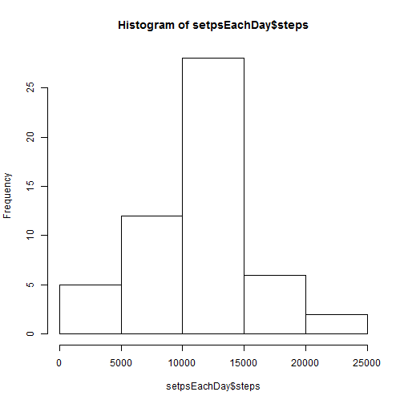
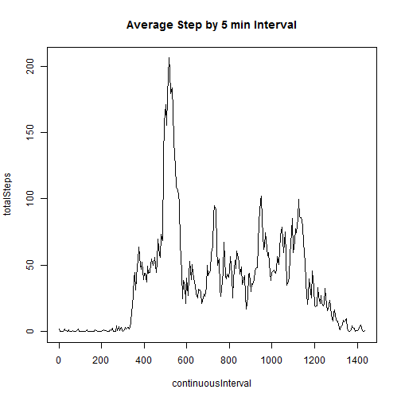
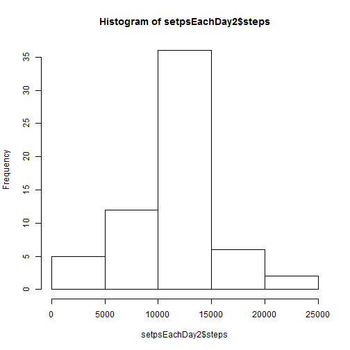
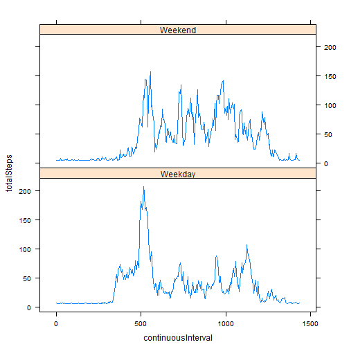

##Loading and Preprocesing the data

Here I load the data and assign the sutable datatypes to each column

```r
rawData <- read.csv("activity.csv", header = TRUE,
                    colClasses = c("integer", "Date", "integer")  
                    )
```


##What is mean total number of steps taken per day?

###Make a histogram of the total number of steps taken each day
Here I sum the steps taken each day and create a new dataset with only the total number of steps by day

```r
setpsEachDay <- aggregate(steps ~ date, data=rawData, sum)
```
Here I create the histogram

```r
hist(setpsEachDay$steps)
```

 

###Calculate and report the mean and median total number of steps taken per day

The mean is

```r
mean(setpsEachDay$steps)
```

```
## [1] 10766.19
```

The median steps taken each day is

```r
median(setpsEachDay$steps)
```

```
## [1] 10765
```


##What is the average daily activity pattern?

Here I average the setps accross the 5-minute interval

```r
setpsByInterval <- aggregate(steps ~ interval, data=rawData, mean)
```

###Make a histogram of the total number of steps taken each day

Notice that in the "interval" column, after min 55, the data jumps to 100, which means 1 hour and 00 min. This is repeated again when from 155, it jumps to 200, which means 2 hours and 00 min. This cannot be plot like this because it would produce jumps in the x axis. To fix this problem, I create a new vector that has all the minutes going in groups of 5 min thought the whole day without making just jump after each hour. So 1 hour and 5 min is represented as 65 instead of 105 and so on. 


```r
setpsByIntervalContinuous <- data.frame(continuousInterval  = seq(0, 1435, 5), totalSteps = setpsByInterval$steps)

with(setpsByIntervalContinuous, plot(continuousInterval, totalSteps, main = "Average Step by 5 min Interval", type = "l"))
```

 

###Which 5-minute interval, on average across all the days in the dataset, contains the maximum number of steps?

First I find the max steps taken in any interval, then I find to which interval it correspond. 


```r
maxSepsTaken <- max(setpsByInterval$steps, na.rm=T)
selectedRow <- setpsByInterval[ which(setpsByInterval$steps==maxSepsTaken), ]
intervalWithTheMostTeps <- selectedRow$interval
intervalWithTheMostTeps
```

```
## [1] 835
```


##Imputing missing values

###Calculate and report the total number of missing values in the dataset (i.e. the total number of rows with NAs)

To do this, I will will create a New dataset eleiminating all the NA values. Then I wil compare the size of this new dataset with the original.


```r
rawDataWithoutNa <- na.omit(rawData)
numberOfNa <- nrow(rawData) - nrow(rawDataWithoutNa)
numberOfNa
```

```
## [1] 2304
```

###Devise a strategy for filling in all of the missing values in the dataset. The strategy does not need to be sophisticated. For example, you could use the mean/median for that day, or the mean for that 5-minute interval, etc.

I will use the missing values with the mean


###Create a new dataset that is equal to the original dataset but with the missing data filled in.

My new dataset is called rawData2

```r
rawData2 <- rawData;

for (i in which(sapply(rawData2, is.numeric))) {
    rawData2[is.na(rawData2[, i]), i] <- mean(rawData2[, i],  na.rm = TRUE)
}
```

###Make a histogram of the total number of steps taken each day and Calculate and report the mean and median total number of steps taken per day. Do these values differ from the estimates from the first part of the assignment? What is the impact of imputing missing data on the estimates of the total daily number of steps?

Here I sum the steps taken each day and create a new dataset with only the total number of steps by day

```r
setpsEachDay2 <- aggregate(steps ~ date, data=rawData2, sum)

hist(setpsEachDay2$steps)
```

 
The mean is

```r
mean(setpsEachDay2$steps)
```

```
## [1] 10766.19
```

The median steps taken each day is

```r
median(setpsEachDay2$steps)
```

```
## [1] 10766.19
```
The mean did not change. The median changed had a small change. This indicades that replacing the missing values with the average does not have a big impact in the resulting mean and median.

##Are there differences in activity patterns between weekdays and weekends?


First I have to create a new column that will contain whether or not each day is a weekday or weekend

```r
library(chron)
library(lattice)
newColumn <- is.weekend(rawData2$date)
newColumn[newColumn == TRUE] <- "Weekend"
newColumn[newColumn == FALSE] <- "Weekday"
rawData2$weekSection <- newColumn
```

Now I need to calculate the steps by intervals and by weekday/weekend using the new dataset with the NA replaced

```r
setpsByInterval2 <- aggregate(steps ~ interval + weekSection , data=rawData2, mean)
```

I also need to fix the intervals here so that the x-axis doesn't have big jumps between the end of one hour and the beginning of the next one. 

```r
setpsByIntervalContinuous2 <- data.frame(continuousInterval  = seq(0, 1435, 5), totalSteps = setpsByInterval2$steps, weekSection = setpsByInterval2$weekSection)
```


Now I create the factor variable and plot


```r
setpsByIntervalContinuous2 <- transform(setpsByIntervalContinuous2, weekSection = factor(weekSection))

xyplot(totalSteps ~ continuousInterval | weekSection, data = setpsByIntervalContinuous2, type="l", layout = c(1, 2))
```

 


```
